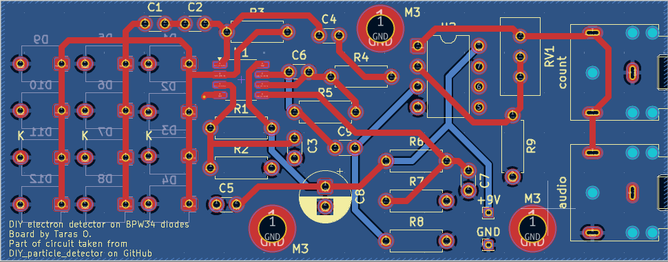

# DIY_particle_detector

A modification of beta radiation (electron) detector by CERN's S'Cool Lab. Features compact design, adjuatable onboard amplification and increased sensitivity (12 diodes instead of 4). Uses BPW34F diodes. Currently not tested.

